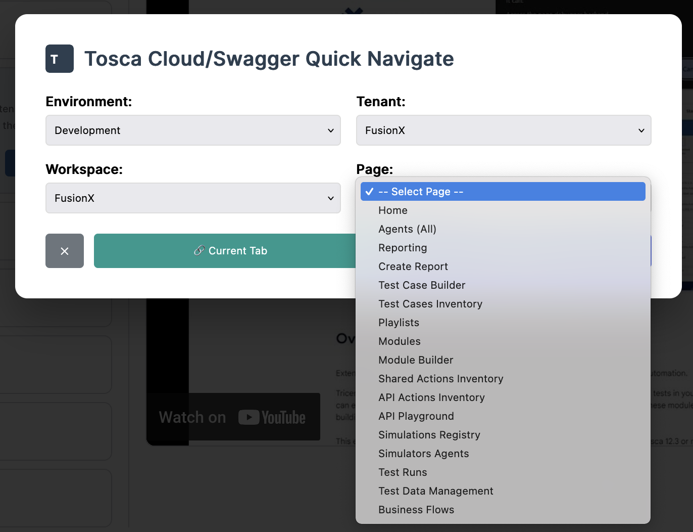
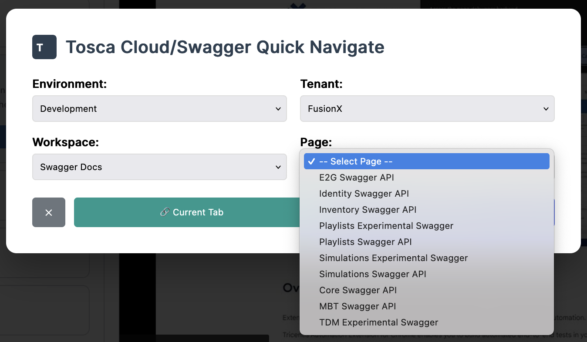

# Tosca Tools

A comprehensive browser-based toolkit for Tosca Cloud environments, featuring cloud navigation, log parsing, and productivity tools.





## 🚀 Quick Start

### Setup

1. **Copy configuration file:**

   **Start with Tricentis**

   ```bash
   cp config.example.json config.json
   ```

   **Start with FusionX**

    ```bash
    cp config.fusionx.json config.json
    ```

2. **Serve via HTTP server** (required to load custom config):

   ```bash
   # Option 1: Python
   python3 -m http.server 8000

   # Option 2: Node.js
   npx serve .

   # Option 3: PHP
   php -S localhost:8000
   ```

3. **Open in browser:**

   ```bash
   http://localhost:8000
   ```

### Option 1: Bookmarklet (Recommended)

1. Visit the tool at `http://localhost:8000`
2. Go to the **Bookmarklet** tab
3. Drag the "📌 Tosca Cloud Navigator" link to your browser's bookmark bar
4. Click the bookmark from any page to open the quick navigator popup

### Option 2: Direct Access

Open the tool directly in your browser to access the full interface with configuration options.

> **Note:** Opening `index.html` directly (`file://` protocol) will use built-in configuration due to CORS restrictions. Use an HTTP server to load your custom `config.json`.

## ✨ Features

### 🎯 Cloud Navigation

#### Smart Defaults

- **Auto-selects Reporting** as the default workspace when available
- **Auto-populates fields** when you're already on a Tosca Cloud page
- **Remembers your configuration** using local storage

#### Navigation Options

- **Environment Selection**: Development, Staging, Production
- **Tenant Selection**: FusionX, Tricentis-CI, Tricentis
- **Workspace Selection**: Reporting, FusionX, API-Simulator, Swagger Docs, and more
- **Page Selection**: Home, Agents, Test Cases, Reports, API Playground, etc.
- **Custom Paths**: Enter any custom path for direct navigation

#### Multiple Access Methods

- **Current Tab**: Navigate in the same tab
- **New Tab**: Open in a new browser tab
- **Bookmarklet**: Quick access from any page

### 📊 Log Parser

#### Advanced Log Analysis

- **Buffer Variable Extraction**: Automatically extracts variables from Tosca Cloud execution logs
- **Multi-line JSON Support**: Handles complex JSON payloads spanning multiple log lines
- **Smart Variable Typing**: Categorizes variables as JSON, Token, URL, ID, Timestamp, or Buffer Variable
- **Context Grouping**: Groups variables by TestCase and Operation context

#### Variable Type Detection

- **JSON**: Structured JSON objects/arrays with syntax highlighting
- **Token**: Access tokens and authentication credentials (truncated for security)
- **URL**: HTTP/HTTPS URLs with clickable links
- **ID**: UUIDs and long alphanumeric identifiers
- **Timestamp**: ISO datetime stamps
- **Buffer Variable**: Standard string variables

#### Multiple View Modes

- **Variables View**: Grouped variable tables with enhanced display
- **Logs View**: Syntax-highlighted log viewer with VS Code-style theming
- **Table View**: Structured data view with collapsible groups

#### Export & Copy Features

- **Individual Variables**: Copy specific variables to clipboard
- **Group Copy**: Copy entire variable groups
- **JSON Export**: Export all parsed data as JSON
- **Real-time Search**: Filter variables across all views

### 🎫 JIRA Integration

- **Quick Ticket Lookup**: Enter ticket numbers for instant JIRA access
- **Smart Prefixing**: Automatically adds "TPI-" prefix to numeric tickets
- **Bookmarklet Access**: JIRA lookup from any page

## 🎯 Usage Examples

### Cloud Navigation

1. Select your environment (e.g., "Development")
2. Tenant automatically selects "FusionX"
3. Workspace automatically selects "Reporting"
4. Choose a specific page or leave default
5. Click "Open in Current Tab" or "Open in New Tab"

### Log Parser Usage

1. Switch to the **Log Parser** tab
2. Paste your Tosca Cloud execution logs or upload a log file
3. Click "Parse Logs" to extract variables
4. Use the search filter to find specific variables
5. Switch between Variables, Logs, and Table views
6. Copy individual variables or export all data as JSON

### JIRA Integration

1. Switch to the **JIRA** tab
2. Enter a ticket number (e.g., "12345" or "TPI-12345")
3. Click to open the ticket in JIRA

### Custom Navigation

- Use the "Custom Path" field to navigate to specific URLs like `/your/custom/path`
- The tool will build the complete URL: `https://fusionx.my-dev.tricentis.com/your/custom/path`

### Smart Auto-Population

When you're already on a Tosca Cloud page (like `https://fusionx.my-dev.tricentis.com/_portal/space/Reporting/home`):

- Environment automatically selects "Development"
- Tenant automatically selects "FusionX"
- Workspace automatically selects "Reporting"
- Ready to navigate to other pages in the same context

## 🔧 Configuration

### Initial Setup

1. **Copy the example config:**

   ```bash
   cp config.example.json config.json
   ```

2. **Edit `config.json`** to match your environments:
   - Update environment URLs (`my-dev`, `my-test`, `my`)
   - Add your tenants and workspaces
   - Customize available pages and swagger endpoints

3. **Refresh the browser** after making changes to load the new configuration

### Adding New Environments

1. Go to the **Configure** tab
2. Use the **Visual Editor** to add new environments
3. Or edit the **JSON Configuration** directly for bulk changes

### Adding New Workspaces

1. In the **Configure** tab, add workspaces to the shared library
2. Assign workspaces to specific tenant/environment combinations
3. Choose workspace types:
   - **Portal Workspace**: Standard Tosca Cloud portal spaces
   - **Custom Path**: Direct links to specific URLs
   - **Swagger**: API documentation endpoints

### Configuration Management

- **Export**: Copy your configuration JSON to share with team members
- **Import**: Paste configuration JSON to quickly set up the tool
- **Reset**: Return to default configuration at any time

## 📚 Available Tools & Workspaces

### Main Tools

- **📊 Log Parser**: Advanced Tosca Cloud log analysis and variable extraction
- **🎯 Navigate**: Quick navigation between Tosca Cloud environments
- **🎫 JIRA**: Quick ticket lookup and access
- **📌 Bookmarklet**: Browser bookmarks for instant access
- **⚙️ Configure**: Environment and workspace configuration

### Standard Workspaces

- **Reporting**: Analytics and reporting tools (default)
- **FusionX**: Main development workspace
- **API-Simulator**: API testing and simulation
- **Swagger Docs**: API documentation

### Available Pages

- **Home**: Dashboard and overview
- **Agents**: Agent management and monitoring
- **Test Cases**: Test case inventory and management
- **Builder**: Test case and module builders
- **Playlists**: Test execution playlists
- **API Playground**: Interactive API testing
- **Reports**: Report creation and viewing
- **TDM**: Test Data Management

## 🌐 Supported Environments

- **Development** (`my-dev.tricentis.com`)
- **Staging** (`my-test.tricentis.com`)
- **Production** (`my.tricentis.com`)

## 💡 Tips & Tricks

### Bookmarklet Best Practices

- **Drag from the source page** to ensure you get the latest version
- **Refresh your browser** after configuration changes to update the bookmarklet
- **Use keyboard shortcuts** (like Ctrl/Cmd+Click) to open in new tabs

### Workflow Optimization

1. **Start from Tosca Cloud pages** to leverage auto-population
2. **Use Reporting defaults** for most common navigation scenarios
3. **Parse logs regularly** to extract variables for API testing
4. **Save custom configurations** for team-specific setups
5. **Share configuration JSON** with team members for consistency

### Troubleshooting

- **Clear browser cache** if favicons don't update
- **Re-drag bookmarklet** after making configuration changes
- **Check URL patterns** if auto-population isn't working
- **Verify JSON syntax** when importing configurations

## 📋 Team Setup

### For Team Leaders

1. Configure the tool with your team's specific environments and workspaces
2. Export the configuration JSON
3. Share the configuration and bookmarklet setup instructions
4. Consider hosting the tool on a shared internal server

### For Team Members

1. Import the shared configuration JSON
2. Set up the bookmarklet for quick access
3. Customize additional workspaces as needed for your specific workflows

## 🔄 Updates

The tool automatically saves your configuration locally. When sharing updates:

1. Export your current configuration as backup
2. Import the new shared configuration
3. Merge any personal customizations as needed

---

**Need help?** Contact your team administrator or check the tool's built-in help documentation.
